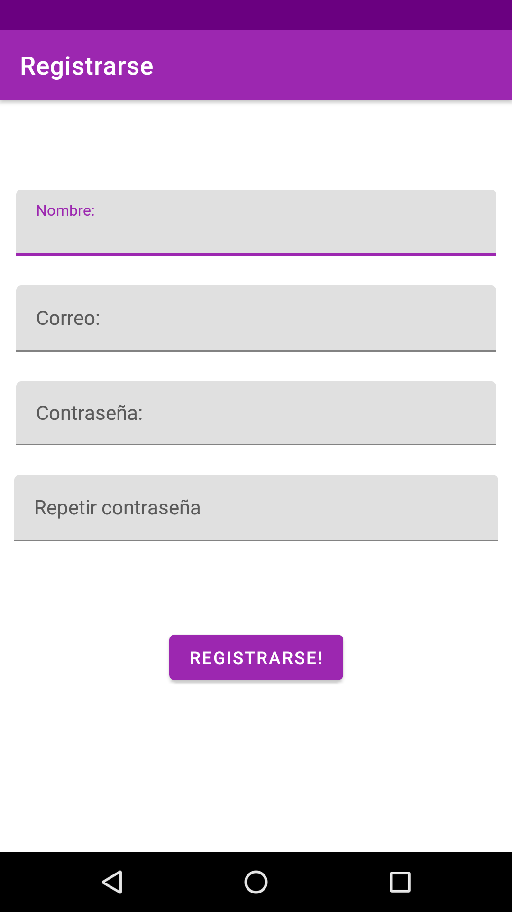
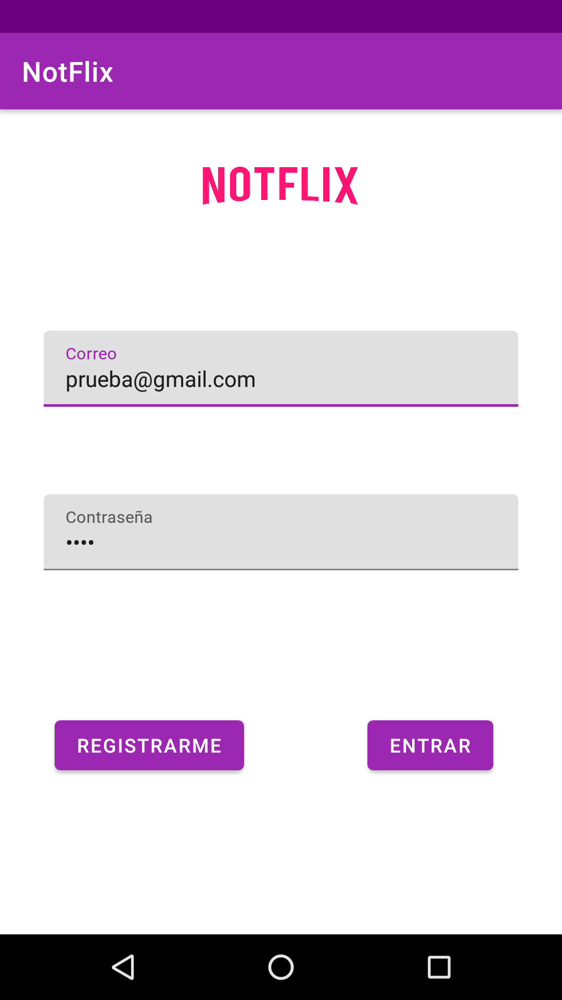
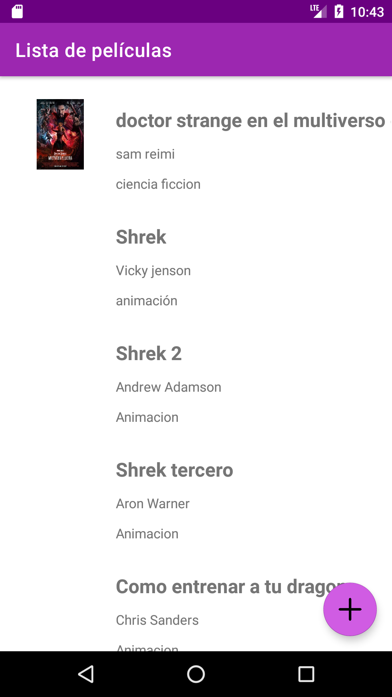
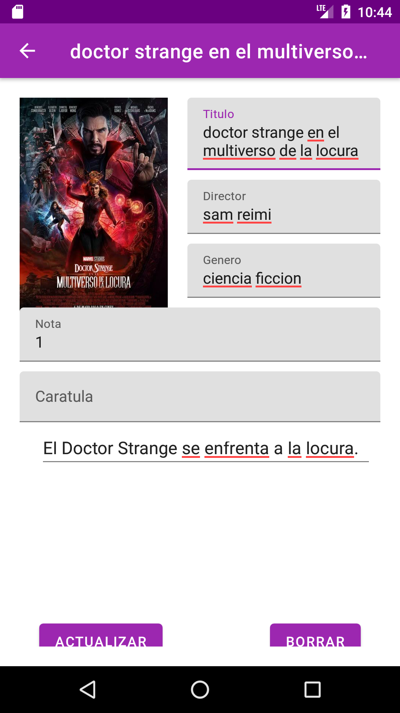
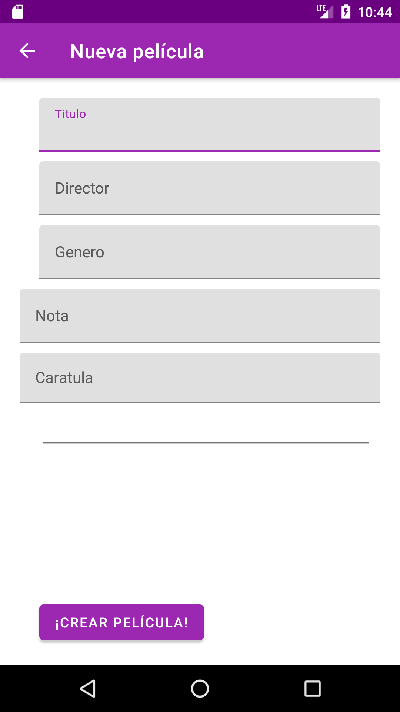

# AplicacionAndroid - NotFlix

Aplicación para listar, ver, editar y borrar películas desde un API (CRUD).
Esta aplicación tiene implementadas las siguientes pantallas:
- Pantalla de login
- Pantalla de registro
- Pantalla de lista de las películas de la API
- Pantalla de detalle de una película
- Pantalla de creación de película

## Pantallas de la aplicación
</img>
</img>
</img>
</img>
</img>
